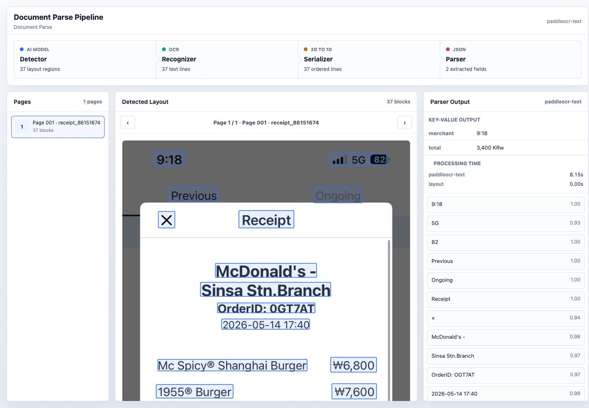

# 로컬 Document Parse Layout MVP

업스테이지 Document Parse처럼 문서를 OCR로 읽고, bbox 기반 레이아웃을 클릭 가능한 화면으로 확인하는 로컬 MVP입니다.

이미지/PDF를 업로드하면 로컬에서 전처리, OCR, 레이아웃 그룹핑, JSON 필드 추출, HTML 뷰어 생성을 수행합니다. 영수증 파싱 테스트와 전결규정 문서 업로드 검증을 빠르게 해보는 목적의 프로토타입입니다.

## 프로토타입 화면



## 주요 기능

- PDF, PNG, JPG, JPEG, WebP 업로드
- 큰 이미지와 PDF 페이지를 OCR 친화적인 WebP로 전처리
- PaddleOCR 기반 한글 OCR 라인 bbox 추출
- OCR 라인을 문맥 단위 layout element로 그룹핑
- 단일/멀티페이지 클릭형 document parse viewer 생성
- OCR 라인과 layout element overlay 토글
- 파싱 결과 `layout.json` 저장
- 기대 JSON과 실제 추출 필드 비교용 Parser Test 화면
- 전결규정 업로드/적용 목록 관리용 로컬 화면

## 사용 기술

- Python 3.12
- `uv`
- PaddleOCR text recognition
- Pillow
- Poppler `pdftoppm`
- WebP 전처리
- 로컬 정적 HTML/CSS/JavaScript viewer
- pytest
- 선택 실험용 baseline: PaddleOCR-VL, Ollama Qwen3-VL

현재 기본 좌표 추출은 PaddleOCR text bbox를 사용합니다. PaddleOCR-VL 또는 Qwen3-VL 결과 파일이 있으면 source metadata로 함께 기록할 수 있도록 슬롯을 열어두었습니다.

## 로컬 데이터 원칙

이 저장소는 공개 저장소로 사용할 수 있게 구성했습니다. 실제 영수증, 사내 문서, 생성 결과는 git에 올리지 않습니다.

무시되는 경로:

- `data/private/`
- `results/`

업로드 파일, KORIE 샘플, OCR 결과, layout viewer 산출물은 모두 위 ignored 경로 아래에 남습니다.

## 빠른 실행

초기 폴더를 만듭니다.

```bash
make setup
```

영수증, 청구서, 전표 이미지 또는 PDF를 아래 경로에 넣습니다.

```text
data/private/raw/
```

파일 inventory를 만듭니다.

```bash
make inventory
```

PaddleOCR text smoke test를 실행합니다.

```bash
make smoke
```

Document Parse layout viewer를 생성합니다.

```bash
make layout
```

생성 결과는 아래 경로에 생깁니다.

```text
results/document_parse/<image_id>/viewer.html
```

## 브라우저 업로드 앱

PDF 또는 이미지를 브라우저에서 직접 업로드하고, 파싱 완료 후 viewer를 바로 열려면:

```bash
make upload-app
```

접속:

```text
http://127.0.0.1:8770
```

업로드 앱은 Parser Test, 전결규정 업로드, 전결규정 관리 화면을 포함합니다. 전결규정으로 업로드한 문서는 로컬 registry에 기록됩니다.

```text
data/private/approval_rules/registry.json
```

## 가벼운 Parser Test 전용 앱

전결규정 관리 화면 없이, 업로드와 파싱 결과 검증만 빠르게 테스트하려면:

```bash
make parser-test-app
```

접속:

```text
http://127.0.0.1:8771
```

이 앱은 아래 API만 제공합니다.

- `POST /api/upload`
- `GET /api/jobs/<job_id>`
- `GET /api/parse-results/<job_id>`
- `GET /results/...`

Parser Test 앱은 항상 `parser_test` 타입으로 저장하므로 전결규정 registry에 영향을 주지 않습니다.

## KORIE 영수증 샘플 테스트

공개 KORIE receipt dataset을 ignored private workspace에 clone하고 샘플 이미지를 복사합니다.

```bash
make korie-clone
make korie-sample
RAW_DIR=data/private/raw/korie SMOKE_LIMIT=3 make layout-smoke
```

KORIE 원본과 생성 결과는 모두 ignored 경로에 남습니다.

## PDF와 큰 이미지 전처리

큰 이미지와 PDF를 WebP로 전처리합니다.

```bash
RAW_DIR=data/private/raw/korie PREPROCESSED_DIR=data/private/preprocessed/korie make preprocess
RAW_DIR=data/private/preprocessed/korie SMOKE_LIMIT=3 make layout-smoke
```

전처리기는 원본을 보존하고, 이미지가 `PREPROCESS_MAX_SIDE`보다 클 때만 resize합니다. PDF는 Poppler `pdftoppm`으로 페이지별 WebP 이미지를 생성합니다.

## 로컬에서 확인한 테스트

- KORIE 영수증 이미지 smoke parsing
- PDF 전처리 및 multipage viewer 생성
- 브라우저 업로드 후 WebP 전처리와 viewer 표시
- Parser Test 화면에서 기대 JSON과 `layout.json` 필드 비교
- layout element overlay와 OCR line overlay 토글
- pytest 자동화 테스트

전체 테스트:

```bash
make test
```

또는:

```bash
uv run --with pytest python -m pytest -q
```

## 주요 파일

- `scripts/document_parse_layout.py`: OCR block 정렬, layout element 그룹핑, HTML viewer 렌더링
- `scripts/run_document_parse_layout.py`: inventory 기반 layout 생성 CLI
- `scripts/upload_app.py`: 업로드 앱, 전결규정 관리, parser 결과 API
- `scripts/parser_test_app.py`: 가벼운 parser-test-only 앱
- `scripts/preprocess_documents.py`: 이미지/PDF WebP 전처리
- `scripts/run_dataset_pipeline.py`: OCR baseline 실행 orchestration
- `tests/test_document_parse_layout.py`: layout/viewer 테스트
- `tests/test_upload_app.py`: 업로드 앱 테스트
- `tests/test_parser_test_app.py`: parser-test-only 앱 테스트

## 모델 메모

현재 MVP의 기본 조합은 다음과 같습니다.

- Detector/Recognizer: PaddleOCR text, Korean
- Layout grouping: OCR bbox 기반 heuristic grouping
- Serializer: bbox reading order 기반 text/Markdown 직렬화
- Parser: MVP용 rule 기반 key-value 추출

정확도를 더 올리는 다음 단계는 VLM 또는 LLM을 무작정 붙이는 것보다, 먼저 문서 타입별 layout element 품질과 필드 스키마를 고정하고 샘플을 모아 평가셋을 만드는 쪽이 좋습니다. 이후 PaddleOCR-VL, Qwen 계열 VLM, 또는 도메인 fine-tuned extractor를 같은 `layout.json` 계약 뒤에 붙이면 됩니다.
